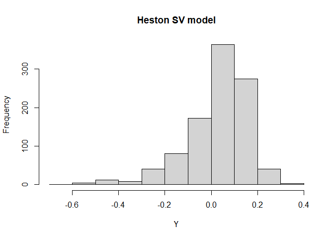

<!-- build with `devtools::build_readme()` -->
<!-- README.md is generated from README.Rmd. Please edit that file -->

# ajd.sim.bk

<!-- badges: start -->
<!-- badges: end -->

The goal of `ajd.sim.bk` is to simulate exactly the Heston Stochastic
Volatility (SV) model and its Affine Jump Diffusion (AJD) extensions
using the method in Broadie and Kaya (2006), hence the name
`ajd.sim.bk`. The extended models include

- SVJ: SV model with jumps in the price process.

- SVCJ: SV model with contemporaneous jumps both in the price and
  variance processes.

## Installation

You can install the development version of `ajd.sim.bk` like so:

``` r
# library(devtools)
install_github("xmlongan/ajd.sim.bk")
```

## Simulate return samples of the Heston SV model

This is a basic example which shows you how to simulate some return (not
the price) samples of the Heston SV model and plot a histogram of these
simulated returns:

``` r
library(ajd.sim.bk)
v0 = 0.010201; k = 6.21; theta = 0.019; sigma = 0.61; rho = -0.7
r = 0.0319; tau = 1
Y = ryield_Hest(1000, v0, tau, r, k, theta, sigma, rho)
hist(Y)
```



If you want to simulate samples from the other two SV models, use:

- `ryield_SVJ()` for SVJ model,

- `ryield_SVCJ()` for SVCJ model.

## Pricing the European call option Using Monte Carlo simulation

If your are interested in pricing the European call option using Monte
Carlo simulation for the Heston SV, SVJ and SVCJ models. Please refer to
functions `?price_Hest`, `?price_SVJ` and `?price_SVCJ`.
